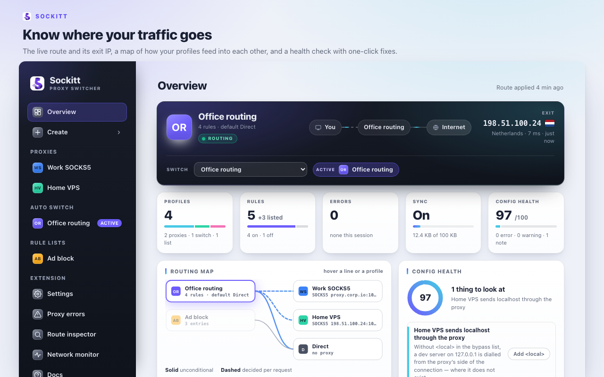
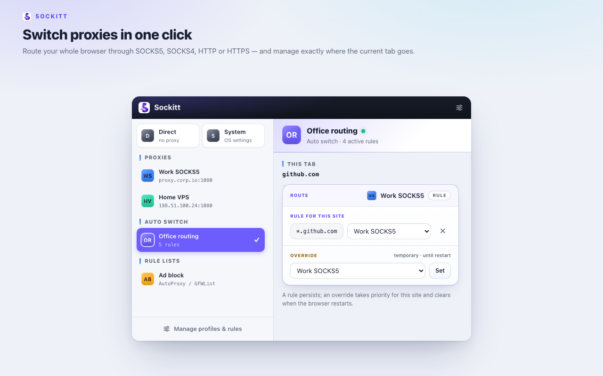
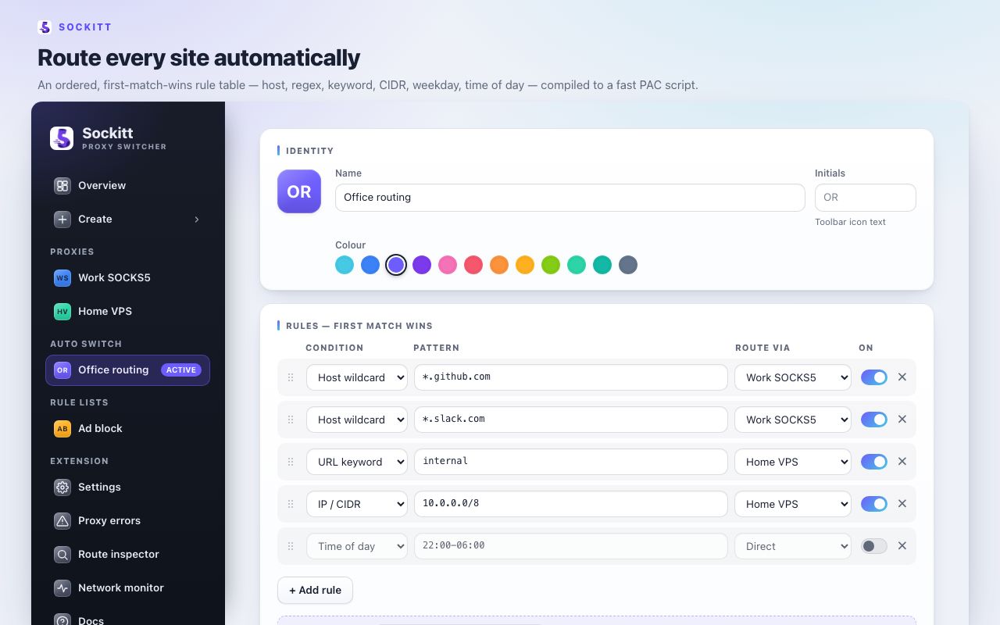

<p align="center">
  
</p>

<p align="center">
  <b>A fast, minimal proxy switcher for Chromium browsers.</b><br>
  One-click switching, rule-based auto routing, zero frameworks, Manifest V3.
</p>

<p align="center">
  <a href="https://chromewebstore.google.com/detail/sockitt-%E2%80%94-proxy-switcher/ebfioiljhjgijbmnnpgadkgmokjbjkca">
    
  </a>
</p>

<p align="center">
  <a href="https://chromewebstore.google.com/detail/sockitt-%E2%80%94-proxy-switcher/ebfioiljhjgijbmnnpgadkgmokjbjkca">Chrome Web Store</a> &nbsp;·&nbsp;
  <a href="https://github.com/ptmplop/Sockitt/releases/latest">Releases</a> &nbsp;·&nbsp;
  <a href="docs/rules.md">Rules reference</a> &nbsp;·&nbsp;
  <a href="docs/architecture.md">Architecture</a> &nbsp;·&nbsp;
  <a href="docs/development.md">Development</a>
</p>

---

Sockitt manages your proxies - SOCKS5, SOCKS4, HTTP, and HTTPS - and decides,
per request, whether traffic goes direct or through one. It is a ground-up,
modern take on the classic proxy-switcher extension: no frameworks, a minimal
default permission set, and a rule engine that compiles to an optimised PAC
script.

<p align="center">
  <br>
  <sub>Overview: the live route and its exit IP, a map of how your profiles feed into each other, and a health check with one-click fixes</sub>
</p>
<p align="center">
  <br>
  <sub>Popup: switch profiles on the left; on the right, where this tab routes, its rule, and where it exits</sub>
</p>
<p align="center">
  <br>
  <sub>Options: an ordered, first-match-wins rule table, compiled to a PAC script</sub>
</p>

## Features

- **Overview dashboard.** The page the options tab opens on, and the answer to
  the question you arrive with: what is active, where traffic exits, and whether
  anything is broken. A live route console with the hop chain and exit IP, a
  drawn **routing map** of how your profiles feed into each other with the
  active path picked out, a **config health** audit with one-click fixes
  (patterns that will not compile, rules buried under a catch-all, credentials
  without their permission, stale rule lists, reference loops), per-server
  reachability, a profile timeline, and an inline URL resolver. Everything on it
  is derived from your own configuration — nothing watches your browsing.
- **Proxy profiles.** SOCKS5, SOCKS4, HTTP, or HTTPS servers with a host, port,
  and per-profile bypass list, plus optional username/password authentication
  for HTTP(S) proxies. Each profile has an identity: an initials avatar in a
  colour of your choice, drawn onto the toolbar icon while it is active.
- **Built-in modes.** *Direct* (no proxy) and *System* (use the OS proxy
  settings).
- **Auto Switch profiles.** An ordered, first-match-wins rule table. Route by
  host wildcard (`*.example.com`), host regex, URL wildcard, URL regex, URL
  keyword, IPv4 CIDR (`10.0.0.0/8`), host-label count, weekday, or time of day.
  Rules can target a proxy, Direct, another switch profile, a rule list, or an
  alias.
- **Rule lists.** Subscribe to AutoProxy/GFWList or plain domain lists by URL
  with auto-update, or paste one in. Domain entries compile to a single
  dictionary lookup, so even very large lists stay fast.
- **Aliases.** Pointer profiles: aim many rules at one alias, then retarget them
  all by editing the alias once.
- **Popup switcher.** Change profile in one click, see where the current tab
  routes, retarget or delete the matching rule inline, or set a temporary
  per-site override that lasts only until the browser restarts. An optional
  exit-IP line (off by default) shows where the current tab actually exits —
  flag, IP, and latency, with the country named in the tooltip.
- **Route inspector.** Trace any URL through your configuration with the same
  resolver real routing uses — which rule fired, the chain it walked, where it
  landed.
- **Network monitor.** Where the inspector answers for one URL you type, this
  answers for everything the browser actually asks for: each request as it
  happens and the profile your rules route it through — including the
  subresources a page pulls in, which is where a rule quietly not firing hides.
  It records only while its page is open and only in that page: nothing is
  written to disk, and closing or leaving the page discards the log and stops
  the recording. Off until you open it, and it asks for the access it needs
  then.
- **Connection tests.** One click routes briefly through a proxy, measures the
  exit IP/country/latency (auth included), and restores your configuration. Like
  the exit-IP line, this uses the opt-in IP address lookups (off by default).
- **Incognito routing.** Optionally give incognito windows their own profile
  (needs "Allow in Incognito").
- **Quick switch.** Cycle a chosen set of profiles from the toolbar button or a
  keyboard shortcut, without opening the popup.
- **Sync and control.** Optional configuration sync across machines via your
  browser account, a startup profile, and a guard that re-takes proxy control
  if another extension grabs it.
- **Honest failure states.** When a proxy is down, requests fail closed rather
  than silently leaking direct. A red mark on the toolbar icon says so — with a
  count (`!`, `!4`, `!9+`) once the failure repeats — and a **Proxy errors**
  page names the error, explains it, says which proxy was carrying traffic, and
  keeps a log. The mark clears itself after 30 seconds without a new failure,
  because a proxy coming back is something the browser never announces.

## Install

**From the Chrome Web Store (easiest).**
[Sockitt — Proxy Switcher](https://chromewebstore.google.com/detail/sockitt-%E2%80%94-proxy-switcher/ebfioiljhjgijbmnnpgadkgmokjbjkca)
— one click, and it updates itself.

**From a release.** Download `sockitt.zip` from the
[latest release](https://github.com/ptmplop/Sockitt/releases/latest) and unzip
it. Open `chrome://extensions`, enable **Developer mode**, click **Load
unpacked**, and select the unzipped folder. Useful for trying a version before
it reaches the store, or for pinning one — unpacked installs do not auto-update.

**From source.**

```sh
git clone https://github.com/ptmplop/Sockitt
cd Sockitt
npm install
npm run build
```

Then load the `dist/` folder unpacked as above. Works on Chrome, Edge, Brave,
Opera, Vivaldi, and other Chromium browsers (Chrome 110+).

## Quick start

1. Click the Sockitt icon, then **Manage profiles & rules**, open **Create** in
   the sidebar and choose **Proxy**. Pick the protocol and enter the host and
   port - for example a SOCKS5 `ssh -D 1080 myserver` tunnel on
   `127.0.0.1:1080`, or an HTTP proxy with a username and password.
2. Pick the profile in the popup. Everything now routes through it.
3. For per-site routing, create an **Auto Switch** profile and activate it. As
   you browse, the popup shows where the current tab routes and lets you add or
   edit a rule for it - permanently, or as a temporary override. This works while
   a page is still loading too: a site you cannot reach directly is shown as the
   tab's target the moment it starts loading, so you can route it through a proxy
   and have Sockitt request it again, instead of waiting for it to time out.

See [docs/rules.md](docs/rules.md) for the full pattern syntax and
[docs/architecture.md](docs/architecture.md) for how it works internally.

## Permissions and privacy

By default Sockitt requests four permissions - `proxy`, `storage`, `activeTab`,
and `alarms` - and **no host permissions**. It cannot read your browsing
history, does not touch page content, and contains no analytics of any kind.
By default the only network requests it makes are fetches of rule-list URLs that
you configure; enabling IP address lookups (opt-in, below) adds lookups of
`ipconfig.is`.

Extra capabilities are strictly opt-in and requested only when you use them:

- **Per-tab route badge** requests `tabs`. The Overview's "Where your tabs go"
  breakdown uses the same grant: tab URLs are resolved locally through your own
  rules to count them, and nothing is stored or sent.
- **HTTP/HTTPS proxy authentication** requests `webRequest`,
  `webRequestAuthProvider`, and all-sites access, which Chromium needs to answer
  proxy auth challenges. Sockitt asks when you set credentials.
- **The Network monitor** requests the same grant for a different purpose:
  observing requests so it can list them. It asks the first time you open the
  page, records only in that page, and writes nothing to disk. An install that
  never opens it never grants it. (It asks for `webRequestAuthProvider` too,
  which it never uses — the two are requested as a pair so the worker's proxy
  auth listener keeps working; the provider grants no access on its own.)
- **IP address lookups** - the popup's exit-IP line and connection tests -
  request access to `ipconfig.is`, the IP-echo service they query. Off by
  default; enable them with one setting, which asks for access the first time.
- **Sync** stores your configuration in your own browser account
  (`chrome.storage.sync`). Proxy credentials are never synced; enter them on
  each machine.

The proxy error log lives in `chrome.storage.session` alone: it is gone when the
browser restarts, is never written to your saved configuration, and is never
synced. It records proxy addresses and ports, never credentials.

## Limitations

- **No SOCKS authentication.** This is a Chromium limitation, not a Sockitt
  choice; secure SOCKS proxies with an IP allow-list or a local tunnel
  (`ssh -D`, WireGuard, and so on). HTTP and HTTPS proxies support
  username/password auth.
- **IPv4-only CIDR.** CIDR rules match literal IPv4 hosts. Sockitt never
  resolves DNS in the request path, and IPv6 CIDR is not supported.
- **Chromium-family browsers only.**

## Development

```sh
npm install
npm run typecheck   # strict TypeScript, no emit
npm test            # runs generated PAC scripts in a Node VM
npm run build       # production build to dist/
npm run watch       # dev build with inline sourcemaps
npm run zip         # store-ready sockitt.zip
npm run crx         # signed sockitt.crx for Chrome Web Store uploads
npm run shots       # regenerate the README + store screenshots from the built UI
npm run icons       # regenerate icons from img/logo-source.png (needs ImageMagick)
```

Project layout and design notes are in [docs/development.md](docs/development.md).

## Acknowledgements

Sockitt is an independent, from-scratch implementation. Its concepts - proxy
profiles, PAC-based automatic switching, and the AutoProxy rule-list format -
are informed by
[Proxy SwitchyOmega](https://github.com/FelisCatus/SwitchyOmega) and its
Manifest V3 fork [ZeroOmega](https://github.com/zero-peak/ZeroOmega), which were
studied as a reference while designing this extension. Sockitt shares no code
with those projects and is released under the MIT license. Thanks to their
authors and maintainers for the prior art.

## Privacy

Sockitt has no analytics and no tracking. With **IP address lookups** off (the
default) it contacts no developer-operated server at all; turning them on adds
lookups of `ipconfig.is` — the developer's own IP-echo service — which sees only
your connecting IP, never your configuration or browsing. Your configuration
stays on your device (or your own browser account if you enable Sync). See the
full [Privacy Policy](PRIVACY.md).

## License

[MIT](LICENSE)
