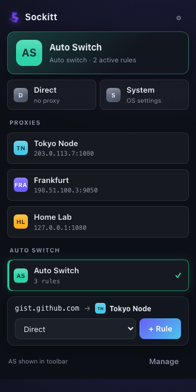
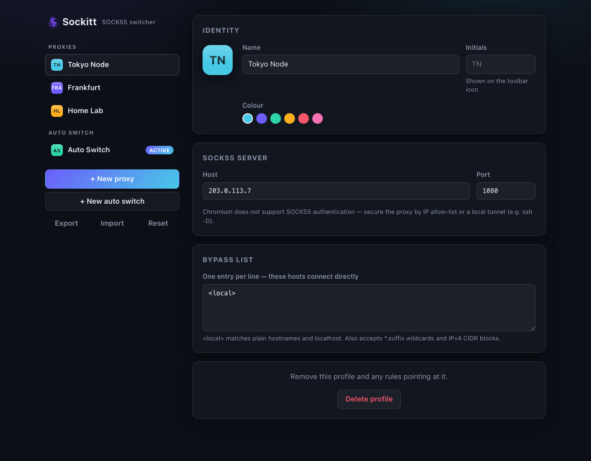

<p align="center">
  
</p>

<p align="center">
  <b>A fast, minimal SOCKS5 proxy switcher for Chromium browsers.</b><br>
  One-click switching, rule-based auto routing, zero frameworks — Manifest V3.
</p>

---

Sockitt manages your SOCKS5 proxies and decides, per request, whether traffic
goes direct or through a proxy. It is a ground-up, modern take on the classic
proxy-switcher extension: ~25 KB of JavaScript in total, three narrow
permissions, and a rule engine that compiles to an optimised PAC script.

<p align="center">
  
  
</p>

## Features

- **Proxy profiles** — SOCKS5 servers with host, port, per-profile bypass list,
  and an identity of their own: an initials avatar (DiceBear-initials style,
  generated locally) in your chosen colour. Initials derive from the name or
  can be set explicitly.
- **Living toolbar icon** — the toolbar shows the active profile's avatar, so
  you always know where your traffic is going at a glance.
- **Built-in modes** — *Direct* (no proxy) and *System* (OS proxy settings).
- **Auto Switch profiles** — an ordered, first-match-wins rule table. Route by:
  - host wildcard — `*.example.com` (matches the bare domain and every subdomain)
  - host regex, URL wildcard, URL regex
  - IPv4 CIDR block — `10.0.0.0/8`
- **Popup switcher** — change profile in one click, see a live *"this tab
  routes via …"* preview, and add a rule for the current site without opening
  settings.
- **Options app** — manage profiles, drag rules to reorder, edit bypass lists,
  export/import your whole setup as JSON.
- **Honest failure states** — a red `!` badge when the proxy errors or when
  another extension takes control of proxy settings. If a proxy is down,
  requests fail closed instead of silently leaking direct.

## Install

**From a release (easiest):** download `sockitt.zip` from the
[latest release](https://github.com/ptmplop/Sockitt/releases/latest) and unzip
it. Open `chrome://extensions`, enable **Developer mode**, click
**Load unpacked**, and select the unzipped folder. (The same zip is the
artifact submitted to the Chrome Web Store — a store listing is planned.)

**From source:**

```sh
git clone https://github.com/ptmplop/Sockitt
cd Sockitt
npm install
npm run build
```

Then load the `dist/` folder unpacked as above.

Works on Chrome, Edge, Brave, Opera, Vivaldi and other Chromium browsers
(Chrome 110+).

## Quick start

1. Click the Sockitt icon → **Manage** → **+ New proxy** — enter your SOCKS5
   host and port (e.g. an `ssh -D 1080 myserver` tunnel on `127.0.0.1:1080`).
2. Pick the profile in the popup — everything now routes through it.
3. Want per-site routing? Create an **Auto Switch** profile, activate it, then
   browse: the popup shows where each tab routes and offers **+ Rule** to send
   the current site through a proxy of your choice.

See [docs/rules.md](docs/rules.md) for the full pattern syntax, and
[docs/architecture.md](docs/architecture.md) for how it works inside.

## Permissions & privacy

Sockitt requests exactly three permissions — `proxy`, `storage`, and
`activeTab` — and **no host permissions**. It cannot read your browsing
history, does not touch page content, makes no network requests of its own,
and contains no analytics of any kind. Your configuration lives in local
extension storage and leaves the browser only when you export it.

## Limitations

- **No SOCKS5 authentication** — a Chromium platform limitation, not a Sockitt
  choice. Secure your proxy with an IP allow-list or a local tunnel
  (`ssh -D`, `wireguard`, etc.).
- CIDR rules match literal IPv4 hosts; Sockitt never resolves DNS in the
  request path, and IPv6 CIDR is not supported.
- Chromium-family browsers only.

## Development

```sh
npm install
npm run typecheck   # strict TypeScript, no emit
npm test            # runs generated PAC scripts in a Node VM
npm run build       # production build → dist/
npm run watch       # dev build with inline sourcemaps
npm run zip         # store-ready sockitt.zip
npm run icons       # regenerate img/ from the inline SVG (needs librsvg)
```

Project layout and design notes: [docs/development.md](docs/development.md).

## License

[MIT](LICENSE)
